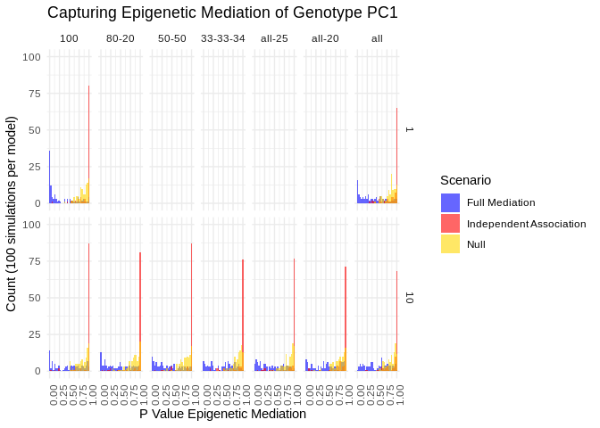
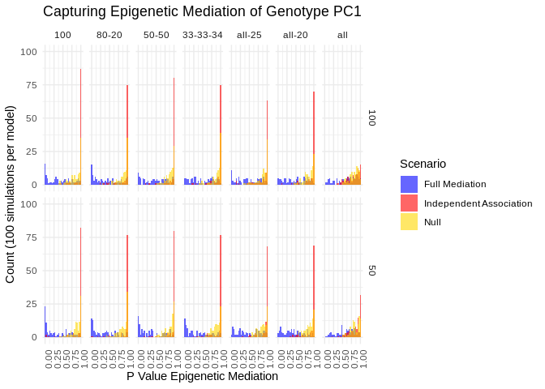
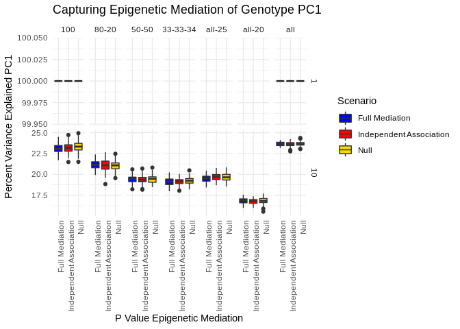
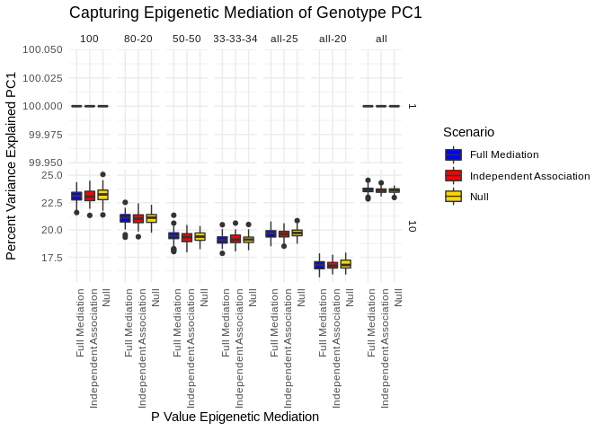

Sanity Check and PCA Comparison
================
William Casazza
May 8, 2019

CIT sanity check
================

At this point I have run a bunch of experiments with "blocky" genotype matrices, with the goal that for PCA the first PC should the majority of variance in matrices I've designed to have correlated genotypes. What I did to generate these matrices was generate a number of random genotypes, and then make varied percentages of the remaining genotypes by adding random noises to the initial set and copying the result over new columns.

First I need to aggregate these sensibly:

``` r
get_sanity_results <- function(path){
  sanity_results <- list()
  for(f in dir(path, full.names = TRUE)){
    tmp_df <- read.csv(f)
    tmp_df$scenario <- gsub(".*/cit_(.*)_([0-9]*)_PCs_([0-9]*)_gen_(.*)_split.csv", "\\1", f)
    tmp_df$num_pc <- gsub(".*/cit_(.*)_([0-9]*)_PCs_([0-9]*)_gen_(.*)_split.csv", "\\2", f)
    tmp_df$num_genotype <- gsub(".*/cit_(.*)_([0-9]*)_PCs_([0-9]*)_gen_(.*)_split.csv", "\\3", f)
    tmp_df$split <- gsub(".*/cit_(.*)_([0-9]*)_PCs_([0-9]*)_gen_(.*)_split.csv", "\\4", f)
    sanity_results[[f]] <- tmp_df
  }
  sanity_df <- bind_rows(sanity_results) %>%
    mutate(
      Scenario = plyr::mapvalues(
        scenario,
        from = c("caus1","ind1","null"), 
        to = c("Full Mediation", "Independent Association", "Null")))
  
  str(sanity_df)
  return(sanity_df)
}
sanity_df <- get_sanity_results("../data/sanity_check/")
```

    ## 'data.frame':    8400 obs. of  63 variables:
    ##  $ test1_beta0      : num  0.238 -0.494 -0.811 0.599 -0.524 ...
    ##  $ test1_beta1      : num  0.369 -0.138 -0.338 0.15 -0.401 ...
    ##  $ test1_rss        : num  753 638 570 561 815 ...
    ##  $ test1_se0        : num  1.35 1.24 1.15 1.14 1.42 ...
    ##  $ test1_se1        : num  1.045 0.954 0.924 0.894 1.096 ...
    ##  $ test1_t0         : num  0.176 -0.4 -0.702 0.528 -0.369 ...
    ##  $ test1_t1         : num  0.353 -0.145 -0.366 0.168 -0.366 ...
    ##  $ test1_p0         : num  0.43 0.655 0.758 0.299 0.644 ...
    ##  $ test1_p1         : num  0.362 0.558 0.643 0.434 0.643 ...
    ##  $ test1_r2         : num  0.1107 0.0206 0.1179 0.0273 0.1179 ...
    ##  $ p1               : num  2.14e-14 1.28e-03 2.78e-15 2.07e-04 2.78e-15 ...
    ##  $ test2_beta0      : num  -0.591 -0.017 0.366 0.393 -0.155 ...
    ##  $ test2_beta1      : num  0.426 -0.452 -0.328 0.347 0.438 ...
    ##  $ test2_beta2      : num  0.322 0.232 0.661 0.32 -0.473 ...
    ##  $ test2_rss        : num  311 363 453 431 340 ...
    ##  $ test2_se0        : num  0.883 1.004 1.258 1.127 0.976 ...
    ##  $ test2_se1        : num  0.643 0.755 0.892 0.877 0.645 ...
    ##  $ test2_se2        : num  0.712 0.727 0.878 0.795 0.753 ...
    ##  $ test2_t0         : num  -0.6697 -0.0169 0.2905 0.3485 -0.1591 ...
    ##  $ test2_t1         : num  0.663 -0.599 -0.368 0.396 0.679 ...
    ##  $ test2_t2         : num  0.453 0.319 0.753 0.402 -0.628 ...
    ##  $ test2_p0         : num  0.748 0.507 0.386 0.364 0.563 ...
    ##  $ test2_p1         : num  0.254 0.725 0.643 0.346 0.249 ...
    ##  $ test2_p2         : num  0.325 0.375 0.226 0.344 0.735 ...
    ##  $ test2_r2         : num  0.487 0.345 0.503 0.276 0.565 ...
    ##  $ p2               : num  1.11e-16 3.76e-12 1.11e-16 1.11e-16 1.11e-16 ...
    ##  $ test3_beta0      : num  0.589 -0.373 -0.581 0.365 -0.247 ...
    ##  $ test3_beta1      : num  0.716 -0.584 -0.363 0.39 0.72 ...
    ##  $ test3_beta2      : num  0.02511 0.03375 -0.05774 0.00472 0.06613 ...
    ##  $ test3_rss        : num  523 470 502 485 558 ...
    ##  $ test3_se0        : num  1.24 1.08 1.25 1.21 1.24 ...
    ##  $ test3_se1        : num  1.081 0.975 0.988 0.985 1.061 ...
    ##  $ test3_se2        : num  1.013 0.867 1.155 0.909 1.138 ...
    ##  $ test3_t0         : num  0.473 -0.346 -0.465 0.301 -0.198 ...
    ##  $ test3_t1         : num  0.663 -0.599 -0.368 0.396 0.679 ...
    ##  $ test3_t2         : num  0.02478 0.03891 -0.04999 0.00519 0.05811 ...
    ##  $ test3_p0         : num  0.318 0.635 0.679 0.382 0.579 ...
    ##  $ test3_p1         : num  0.254 0.725 0.643 0.346 0.249 ...
    ##  $ test3_p2         : num  0.49 0.484 0.52 0.498 0.477 ...
    ##  $ test3_r2         : num  0.382 0.279 0.223 0.159 0.396 ...
    ##  $ p3               : num  1.11e-16 1.11e-16 2.11e-15 1.11e-16 1.11e-16 ...
    ##  $ test4_beta0      : num  0.589 -0.373 -0.581 0.365 -0.247 ...
    ##  $ test4_beta1      : num  0.716 -0.584 -0.363 0.39 0.72 ...
    ##  $ test4_beta2      : num  0.02511 0.03375 -0.05774 0.00472 0.06613 ...
    ##  $ test4_rss        : num  523 470 502 485 558 ...
    ##  $ test4_se0        : num  1.24 1.08 1.25 1.21 1.24 ...
    ##  $ test4_se1        : num  1.081 0.975 0.988 0.985 1.061 ...
    ##  $ test4_se2        : num  1.013 0.867 1.155 0.909 1.138 ...
    ##  $ test4_t0         : num  0.473 -0.346 -0.465 0.301 -0.198 ...
    ##  $ test4_t1         : num  0.663 -0.599 -0.368 0.396 0.679 ...
    ##  $ test4_t2         : num  0.02478 0.03891 -0.04999 0.00519 0.05811 ...
    ##  $ test4_p0         : num  0.318 0.635 0.679 0.382 0.579 ...
    ##  $ test4_p1         : num  0.254 0.725 0.643 0.346 0.249 ...
    ##  $ test4_p2         : num  0.49 0.484 0.52 0.498 0.477 ...
    ##  $ test4_r2         : num  0.382 0.279 0.223 0.159 0.396 ...
    ##  $ p4               : num  0.0163 0.0153 0 0 0.001 ...
    ##  $ var_explained_pcs: num  1 1 1 1 1 1 1 1 1 1 ...
    ##  $ omni_p           : num  1.63e-02 1.53e-02 2.78e-15 2.07e-04 1.00e-03 ...
    ##  $ scenario         : chr  "caus1" "caus1" "caus1" "caus1" ...
    ##  $ num_pc           : chr  "1" "1" "1" "1" ...
    ##  $ num_genotype     : chr  "1" "1" "1" "1" ...
    ##  $ split            : chr  "100" "100" "100" "100" ...
    ##  $ Scenario         : chr  "Full Mediation" "Full Mediation" "Full Mediation" "Full Mediation" ...

``` r
sanity_df_perm <- get_sanity_results("../data/sanity_check_perm/")
```

    ## 'data.frame':    8400 obs. of  63 variables:
    ##  $ test1_beta0      : num  -0.6365 -0.2969 0.0352 -0.4389 -1.3814 ...
    ##  $ test1_beta1      : num  0.4783 0.0676 -0.0493 0.4018 0.0109 ...
    ##  $ test1_rss        : num  839 554 562 552 798 ...
    ##  $ test1_se0        : num  1.43 1.14 1.16 1.15 1.39 ...
    ##  $ test1_se1        : num  1.168 0.856 0.897 0.891 1.035 ...
    ##  $ test1_t0         : num  -0.4461 -0.261 0.0304 -0.3827 -0.9957 ...
    ##  $ test1_t1         : num  0.4095 0.0789 -0.055 0.451 0.0105 ...
    ##  $ test1_p0         : num  0.672 0.603 0.488 0.649 0.84 ...
    ##  $ test1_p1         : num  0.341 0.469 0.522 0.326 0.496 ...
    ##  $ test1_r2         : num  0.14361 0.00619 0.00301 0.16905 0.00011 ...
    ##  $ p1               : num  1.11e-16 7.88e-02 2.20e-01 1.11e-16 8.15e-01 ...
    ##  $ test2_beta0      : num  0.6123 0.2197 -0.8652 0.6812 0.0743 ...
    ##  $ test2_beta1      : num  0.475 -0.285 -0.405 -0.313 0.492 ...
    ##  $ test2_beta2      : num  0.47439 -0.12125 -0.0759 -0.63019 0.00193 ...
    ##  $ test2_rss        : num  352 388 425 383 285 ...
    ##  $ test2_se0        : num  1.011 0.984 1.007 1.024 1.171 ...
    ##  $ test2_se1        : num  0.647 0.837 0.87 0.833 0.598 ...
    ##  $ test2_se2        : num  0.817 0.719 0.781 0.815 0.619 ...
    ##  $ test2_t0         : num  0.6054 0.2233 -0.8593 0.6655 0.0634 ...
    ##  $ test2_t1         : num  0.734 -0.34 -0.466 -0.376 0.823 ...
    ##  $ test2_t2         : num  0.58066 -0.16868 -0.09721 -0.77371 0.00311 ...
    ##  $ test2_p0         : num  0.273 0.412 0.805 0.253 0.475 ...
    ##  $ test2_p1         : num  0.232 0.633 0.679 0.646 0.206 ...
    ##  $ test2_p2         : num  0.281 0.567 0.539 0.78 0.499 ...
    ##  $ test2_r2         : num  0.583 0.134 0.182 0.541 0.404 ...
    ##  $ p2               : num  1.11e-16 1.90e-04 3.07e-02 1.11e-16 9.45e-01 ...
    ##  $ test3_beta0      : num  -0.865 -0.186 -0.352 -0.116 -0.885 ...
    ##  $ test3_beta1      : num  0.737 -0.364 -0.44 -0.395 0.82 ...
    ##  $ test3_beta2      : num  -0.03863 0.01638 -0.07392 0.10319 0.00489 ...
    ##  $ test3_rss        : num  545 496 462 484 476 ...
    ##  $ test3_se0        : num  1.19 1.13 1.34 1.38 1.23 ...
    ##  $ test3_se1        : num  1.004 1.071 0.945 1.051 0.997 ...
    ##  $ test3_se2        : num  1.176 0.824 0.814 1.152 0.799 ...
    ##  $ test3_t0         : num  -0.726 -0.165 -0.263 -0.084 -0.719 ...
    ##  $ test3_t1         : num  0.734 -0.34 -0.466 -0.376 0.823 ...
    ##  $ test3_t2         : num  -0.03285 0.01987 -0.09076 0.08957 0.00612 ...
    ##  $ test3_p0         : num  0.766 0.566 0.604 0.533 0.764 ...
    ##  $ test3_p1         : num  0.232 0.633 0.679 0.646 0.206 ...
    ##  $ test3_p2         : num  0.513 0.492 0.536 0.464 0.498 ...
    ##  $ test3_r2         : num  0.443 0.109 0.181 0.272 0.404 ...
    ##  $ p3               : num  1.11e-16 1.64e-13 1.11e-16 5.55e-16 1.11e-16 ...
    ##  $ test4_beta0      : num  -0.865 -0.186 -0.352 -0.116 -0.885 ...
    ##  $ test4_beta1      : num  0.737 -0.364 -0.44 -0.395 0.82 ...
    ##  $ test4_beta2      : num  -0.03863 0.01638 -0.07392 0.10319 0.00489 ...
    ##  $ test4_rss        : num  545 496 462 484 476 ...
    ##  $ test4_se0        : num  1.19 1.13 1.34 1.38 1.23 ...
    ##  $ test4_se1        : num  1.004 1.071 0.945 1.051 0.997 ...
    ##  $ test4_se2        : num  1.176 0.824 0.814 1.152 0.799 ...
    ##  $ test4_t0         : num  -0.726 -0.165 -0.263 -0.084 -0.719 ...
    ##  $ test4_t1         : num  0.734 -0.34 -0.466 -0.376 0.823 ...
    ##  $ test4_t2         : num  -0.03285 0.01987 -0.09076 0.08957 0.00612 ...
    ##  $ test4_p0         : num  0.766 0.566 0.604 0.533 0.764 ...
    ##  $ test4_p1         : num  0.232 0.633 0.679 0.646 0.206 ...
    ##  $ test4_p2         : num  0.513 0.492 0.536 0.464 0.498 ...
    ##  $ test4_r2         : num  0.443 0.109 0.181 0.272 0.404 ...
    ##  $ p4               : num  2.68e-06 3.18e-09 6.77e-05 5.80e-09 1.54e-113 ...
    ##  $ var_explained_pcs: num  1 1 1 1 1 1 1 1 1 1 ...
    ##  $ omni_p           : num  2.68e-06 7.88e-02 2.20e-01 5.80e-09 9.45e-01 ...
    ##  $ scenario         : chr  "caus1" "caus1" "caus1" "caus1" ...
    ##  $ num_pc           : chr  "1" "1" "1" "1" ...
    ##  $ num_genotype     : chr  "1" "1" "1" "1" ...
    ##  $ split            : chr  "100" "100" "100" "100" ...
    ##  $ Scenario         : chr  "Full Mediation" "Full Mediation" "Full Mediation" "Full Mediation" ...

Okay, just given this peek things are looking good, lets plot to get a nice overall view of the results we have here:

``` r
plot_pvals <- function(sanity_df){
  split_level <- c("100", "80-20", "50-50", "33-33-34", "all-25", "all-20", "all")
  sm_split <- c("80-20", "50-50", "33-33-34", "all-25", "all-20")

  p1 <- ggplot(
      sanity_df %>% 
      filter(as.numeric(num_genotype) < 50,!(split %in% sm_split & num_genotype == 1)) %>% 
      mutate(split = fct_relevel(split, split_level)), 
      aes(omni_p , fill = Scenario)) + 
    geom_histogram(position = "identity", alpha = 0.6) + 
    scale_fill_manual(values = c("blue", "red", "gold")) + 
    labs(y = "Count (100 simulations per model)",x = "P Value Epigenetic Mediation") + 
    ggtitle("Capturing Epigenetic Mediation of Genotype PC1") +
    theme_minimal(base_family = "Arial") +
    theme(axis.text.x = element_text(hjust = 1,vjust =1,angle = 90)) +
    scale_y_continuous(limits=c(0,100)) + 
    facet_grid(num_genotype ~ split)
  p2 <- ggplot(
      sanity_df %>% 
      filter(as.numeric(num_genotype) >= 50) %>% 
      mutate(split = fct_relevel(split, split_level)),
      aes(omni_p , fill = Scenario)) + 
    geom_histogram(position = "identity", alpha = 0.6) + 
    scale_fill_manual(values = c("blue", "red", "gold")) + 
    labs(y = "Count (100 simulations per model)",x = "P Value Epigenetic Mediation") + 
    ggtitle("Capturing Epigenetic Mediation of Genotype PC1") +
    theme_minimal(base_family = "Arial") +
    theme(axis.text.x = element_text(hjust = 1,vjust =1,angle = 90)) +
    scale_y_continuous(limits=c(0,100)) + 
    facet_grid(num_genotype ~ split)
  print(p1)
  print(p2)
}
plot_pvals(sanity_df)
```

    ## `stat_bin()` using `bins = 30`. Pick better value with `binwidth`.



    ## `stat_bin()` using `bins = 30`. Pick better value with `binwidth`.

 Great, we see that with more distinct groups we get a lower ability to detect a the full mediation scenario. Let's just see how well we capture variance in genotype in each scenario with their first PC:

``` r
plot_var_explained <- function(sanity_df){
  split_level <- c("100", "80-20", "50-50", "33-33-34", "all-25", "all-20", "all")
  sm_split <- c("80-20", "50-50", "33-33-34", "all-25", "all-20")
  p1 <- ggplot(
      sanity_df %>% 
      filter(as.numeric(num_genotype) < 50, !(split %in% sm_split & num_genotype == 1)) %>% 
      mutate(split = fct_relevel(split, split_level),
             var_explained_pcs = var_explained_pcs * 100),
      aes(Scenario, var_explained_pcs, fill = Scenario)) + 
    geom_boxplot() + 
    scale_fill_manual(values = c("blue", "red", "gold")) + 
    labs(y = "Percent Variance Explained PC1",x = "P Value Epigenetic Mediation") + 
    ggtitle("Capturing Epigenetic Mediation of Genotype PC1") +
    theme_minimal(base_family = "Arial") +
    theme(axis.text.x = element_text(hjust = 1,vjust =1,angle = 90)) +
    facet_grid(num_genotype ~ split, scales = "free_y")
  p2 <- ggplot(
      sanity_df %>% 
      filter(as.numeric(num_genotype) >= 50) %>% 
      mutate(split = fct_relevel(split, split_level),
             var_explained_pcs = var_explained_pcs * 100),
      aes(Scenario, var_explained_pcs, fill = Scenario)) + 
    geom_boxplot() + 
    scale_fill_manual(values = c("blue", "red", "gold")) + 
    labs(y = "Percent Variance Explained PC1",x = "P Value Epigenetic Mediation") + 
    ggtitle("Capturing Epigenetic Mediation of Genotype PC1") +
    theme_minimal(base_family = "Arial") +
    theme(axis.text.x = element_text(hjust = 1,vjust =1,angle = 90)) +
    facet_grid(num_genotype ~ split)
  print(p1)
  print(p2)
}
plot_var_explained(sanity_df)
```

 Variance explained by the first PC goes down as we vary correlated groups, in the case that we just have independent binomials as genotype, we explain similar amount of variance in genotype with PC1 as we do with random noise + repeats of one genotype.

We get inflated results for independent and full mediation scenarios if we use a semi-parametric test:

``` r
plot_pvals(sanity_df_perm)
```

    ## `stat_bin()` using `bins = 30`. Pick better value with `binwidth`.


    ## `stat_bin()` using `bins = 30`. Pick better value with `binwidth`.


``` r
plot_var_explained(sanity_df_perm)
```



PCA CIT Comparison to xQTL Paper
================================

First we need to load in the data and match up results:

``` r
cit_df <- read.table("../data/rosmap_cit_pca/CIT_groupby_order.txt", header = TRUE)
dim(cit_df)
```

    ## [1] 20916    12

``` r
head(cit_df)
```

    ##          snp nProbe nPeak                                      probes
    ## 1  rs4985407      3     2            cg02727363,cg09029538,cg11996632
    ## 2 rs11087520      1     5                                  cg06913219
    ## 3  rs1130694      1     5                                  cg24007254
    ## 4 rs11699203      1     5                                  cg06913219
    ## 5    rs12428      1     5                                  cg06913219
    ## 6  rs1555329      4     3 cg02738255,cg04348305,cg06421707,cg08601574
    ##                                               peaks   gene   pCausal
    ## 1                                 peak9739,peak9740   AARS 0.9862797
    ## 2 peak15649,peak15655,peak15658,peak15659,peak15666 ABHD12 0.6458592
    ## 3 peak15649,peak15655,peak15658,peak15659,peak15666 ABHD12 0.7017029
    ## 4 peak15649,peak15655,peak15658,peak15659,peak15666 ABHD12 0.6458592
    ## 5 peak15649,peak15655,peak15658,peak15659,peak15666 ABHD12 0.7723184
    ## 6                     peak15649,peak15659,peak15666 ABHD12 0.4178749
    ##    pCausalM  pCausalA    pReact   pReactM   pReactA
    ## 1 0.9145289 0.1042051 0.9862797 0.8930241 0.2053421
    ## 2 0.2971486 0.9451771 0.6458592 0.2971486 0.9451771
    ## 3 0.7432389 0.9320579 0.6804833 0.8196928 0.9320579
    ## 4 0.2971486 0.9451771 0.6458592 0.2971486 0.9451771
    ## 5 0.3930002 0.9732645 0.7723184 0.3930002 0.9732645
    ## 6 0.4885080 0.7950045 0.4178749 0.4885080 0.7950045

``` r
pca_cit_df <- read.csv("../data/rosmap_cit_pca/pca_1_latent_cit.csv")
dim(pca_cit_df)
```

    ## [1] 20916    57

``` r
head(pca_cit_df)
```

    ##   test1_beta0 test1_beta1 test1_rss test1_se0 test1_se1   test1_t0
    ## 1   0.1732667 -0.16522870   98.0732 0.9126164 0.7748615 0.18985705
    ## 2   0.0336713  0.04134247  114.5056 0.5278281 0.0614563 0.06379218
    ## 3   0.0336713  0.04134247  114.5056 0.5278281 0.0614563 0.06379218
    ## 4   0.0336713  0.04134247  114.5056 0.5278281 0.0614563 0.06379218
    ## 5   0.0336713  0.04134247  114.5056 0.5278281 0.0614563 0.06379218
    ## 6   0.0336713  0.04134247  114.5056 0.5278281 0.0614563 0.06379218
    ##     test1_t1  test1_p0  test1_p1   test1_r2           p1  test2_beta0
    ## 1 -0.2132364 0.4247577 0.5843756 0.04349219 2.026113e-05  0.111915675
    ## 2  0.6727132 0.4745834 0.2507548 0.31155224 1.110223e-16  0.004537064
    ## 3  0.6727132 0.4745834 0.2507548 0.31155224 1.110223e-16  0.023603910
    ## 4  0.6727132 0.4745834 0.2507548 0.31155224 1.110223e-16  0.004537064
    ## 5  0.6727132 0.4745834 0.2507548 0.31155224 1.110223e-16  0.004537064
    ## 6  0.6727132 0.4745834 0.2507548 0.31155224 1.110223e-16 -0.026518586
    ##   test2_beta1  test2_beta2 test2_rss test2_se0 test2_se1 test2_se2
    ## 1 -0.10283580 -0.136151909  391.9949 1.8571319  1.999240 1.5839624
    ## 2  0.02351339 -0.003143372  372.4537 0.9538874  1.803527 0.1335838
    ## 3 -0.04403933  0.000318985  388.2442 0.9738979  1.841362 0.1363861
    ## 4  0.02351339 -0.003143372  372.4537 0.9538874  1.803527 0.1335838
    ## 5  0.02351339 -0.003143372  372.4537 0.9538874  1.803527 0.1335838
    ## 6  0.10404784 -0.007653909  441.2192 1.0382170  1.962971 0.1453934
    ##       test2_t0    test2_t1     test2_t2  test2_p0  test2_p1  test2_p2
    ## 1  0.060262641 -0.05143743 -0.085956529 0.4759879 0.5204990 0.5342285
    ## 2  0.004756394  0.01303744 -0.023531094 0.4981036 0.4948021 0.5093809
    ## 3  0.024236534 -0.02391672  0.002338839 0.4903379 0.5095346 0.4990675
    ## 4  0.004756394  0.01303744 -0.023531094 0.4981036 0.4948021 0.5093809
    ## 5  0.004756394  0.01303744 -0.023531094 0.4981036 0.4948021 0.5093809
    ## 6 -0.025542430  0.05300530 -0.052642747 0.5101826 0.4788768 0.5209789
    ##       test2_r2         p2 test3_beta0  test3_beta1 test3_beta2 test3_rss
    ## 1 0.0084899056 0.08327684   0.1760186  0.001816382 -0.16799490  98.07195
    ## 2 0.0005534196 0.63482409   0.0336713  0.003022106  0.04108141 114.50053
    ## 3 0.0007475509 0.96234329   0.0336713 -0.005115037  0.04179756 114.49079
    ## 4 0.0005534196 0.63482409   0.0336713  0.003022106  0.04108141 114.50053
    ## 5 0.0005534196 0.63482409   0.0336713  0.003022106  0.04108141 114.50053
    ## 6 0.0035689768 0.28826065   0.0336713 -0.019248600  0.04386765 114.33707
    ##   test3_se0 test3_se1  test3_se2   test3_t0     test3_t1   test3_t2
    ## 1 1.1953907 0.5095926 1.09667012 0.14724778  0.003564380 -0.1531864
    ## 2 0.5278164 0.4535776 0.07288236 0.06379360  0.006662821  0.5636674
    ## 3 0.5277939 0.4495768 0.07332341 0.06379631 -0.011377451  0.5700438
    ## 4 0.5278164 0.4535776 0.07288236 0.06379360  0.006662821  0.5636674
    ## 5 0.5278164 0.4535776 0.07288236 0.06379360  0.006662821  0.5636674
    ## 6 0.5274395 0.5013404 0.08998326 0.06383918 -0.038394272  0.4875090
    ##    test3_p0  test3_p1  test3_p2   test3_r2        p3 test4_beta0
    ## 1 0.4415045 0.4985789 0.5608366 0.04350434 0.9426396   0.1760186
    ## 2 0.4745829 0.4973436 0.2866447 0.31158280 0.8930084   0.0336713
    ## 3 0.4745818 0.5045361 0.2844805 0.31164135 0.8183521   0.0336713
    ## 4 0.4745829 0.4973436 0.2866447 0.31158280 0.8930084   0.0336713
    ## 5 0.4745829 0.4973436 0.2866447 0.31158280 0.8930084   0.0336713
    ## 6 0.4745647 0.5153040 0.3130794 0.31256560 0.4384780   0.0336713
    ##    test4_beta1 test4_beta2 test4_rss test4_se0 test4_se1  test4_se2
    ## 1  0.001816382 -0.16799490  98.07195 1.1953907 0.5095926 1.09667012
    ## 2  0.003022106  0.04108141 114.50053 0.5278164 0.4535776 0.07288236
    ## 3 -0.005115037  0.04179756 114.49079 0.5277939 0.4495768 0.07332341
    ## 4  0.003022106  0.04108141 114.50053 0.5278164 0.4535776 0.07288236
    ## 5  0.003022106  0.04108141 114.50053 0.5278164 0.4535776 0.07288236
    ## 6 -0.019248600  0.04386765 114.33707 0.5274395 0.5013404 0.08998326
    ##     test4_t0     test4_t1   test4_t2  test4_p0  test4_p1  test4_p2
    ## 1 0.14724778  0.003564380 -0.1531864 0.4415045 0.4985789 0.5608366
    ## 2 0.06379360  0.006662821  0.5636674 0.4745829 0.4973436 0.2866447
    ## 3 0.06379631 -0.011377451  0.5700438 0.4745818 0.5045361 0.2844805
    ## 4 0.06379360  0.006662821  0.5636674 0.4745829 0.4973436 0.2866447
    ## 5 0.06379360  0.006662821  0.5636674 0.4745829 0.4973436 0.2866447
    ## 6 0.06383918 -0.038394272  0.4875090 0.4745647 0.5153040 0.3130794
    ##     test4_r2    p4 omni_p
    ## 1 0.04350434 0.999  0.999
    ## 2 0.31158280 1.000  1.000
    ## 3 0.31164135 1.000  1.000
    ## 4 0.31158280 1.000  1.000
    ## 5 0.31158280 1.000  1.000
    ## 6 0.31256560 1.000  1.000

``` r
merged_cit_df <- cbind(cit_df[c("snp", "probes","peaks", "pCausal","gene")], pca_cit_df[c("p1","p2","p3","p4","omni_p")])
head(merged_cit_df)
```

    ##          snp                                      probes
    ## 1  rs4985407            cg02727363,cg09029538,cg11996632
    ## 2 rs11087520                                  cg06913219
    ## 3  rs1130694                                  cg24007254
    ## 4 rs11699203                                  cg06913219
    ## 5    rs12428                                  cg06913219
    ## 6  rs1555329 cg02738255,cg04348305,cg06421707,cg08601574
    ##                                               peaks   pCausal   gene
    ## 1                                 peak9739,peak9740 0.9862797   AARS
    ## 2 peak15649,peak15655,peak15658,peak15659,peak15666 0.6458592 ABHD12
    ## 3 peak15649,peak15655,peak15658,peak15659,peak15666 0.7017029 ABHD12
    ## 4 peak15649,peak15655,peak15658,peak15659,peak15666 0.6458592 ABHD12
    ## 5 peak15649,peak15655,peak15658,peak15659,peak15666 0.7723184 ABHD12
    ## 6                     peak15649,peak15659,peak15666 0.4178749 ABHD12
    ##             p1         p2        p3    p4 omni_p
    ## 1 2.026113e-05 0.08327684 0.9426396 0.999  0.999
    ## 2 1.110223e-16 0.63482409 0.8930084 1.000  1.000
    ## 3 1.110223e-16 0.96234329 0.8183521 1.000  1.000
    ## 4 1.110223e-16 0.63482409 0.8930084 1.000  1.000
    ## 5 1.110223e-16 0.63482409 0.8930084 1.000  1.000
    ## 6 1.110223e-16 0.28826065 0.4384780 1.000  1.000

Since I'm a nice person, I made these tables have the same order per test, so I just need to plot p values along the same axes for a nice comparison:

``` r
summary(merged_cit_df$omni_p)
```

    ##    Min. 1st Qu.  Median    Mean 3rd Qu.    Max. 
    ## 0.05957 1.00000 1.00000 0.99769 1.00000 1.00000

``` r
summary(merged_cit_df$p1)
```

    ##      Min.   1st Qu.    Median      Mean   3rd Qu.      Max. 
    ## 0.0000000 0.0000000 0.0000000 0.0005303 0.0000000 0.6161732

``` r
summary(merged_cit_df$p2)
```

    ##    Min. 1st Qu.  Median    Mean 3rd Qu.    Max. 
    ##  0.0000  0.2541  0.5187  0.5025  0.7529  0.9998

``` r
summary(merged_cit_df$p3)
```

    ##     Min.  1st Qu.   Median     Mean  3rd Qu.     Max. 
    ## 0.000000 0.007709 0.166099 0.288317 0.528542 0.999755

``` r
summary(merged_cit_df$p4)
```

    ##    Min. 1st Qu.  Median    Mean 3rd Qu.    Max. 
    ##  0.0116  1.0000  1.0000  0.9968  1.0000  1.0000

``` r
summary(merged_cit_df$pCausal)
```

    ##    Min. 1st Qu.  Median    Mean 3rd Qu.    Max. 
    ## 0.00000 0.00266 0.13462 0.35124 0.76638 1.00000

``` r
library(ggrepel)
ggplot(merged_cit_df,aes(-log10(omni_p), -log10(pCausal))) +
  geom_point() +
  geom_label_repel(
    aes(-log10(omni_p),-log10(pCausal),label=gene), 
    data = merged_cit_df[-log10(merged_cit_df$omni_p) >0.3,],
    alpha=0.5)+
  geom_hline(yintercept = -log10(0.05 / nrow(merged_cit_df)), alpha = 0.5, color = "red")+
  geom_vline(xintercept = -log10(0.05 / length(unique(merged_cit_df$omni_p))), alpha = 0.5, color = "red")
```


``` r
ggplot(merged_cit_df,aes(-log10(p1), -log10(pCausal))) + geom_point()
```


``` r
ggplot(merged_cit_df,aes(-log10(p2), -log10(pCausal))) + geom_point()
```


``` r
ggplot(merged_cit_df,aes(-log10(p3), -log10(pCausal))) + geom_point()
```


``` r
ggplot(merged_cit_df,aes(-log10(p4), -log10(pCausal))) + geom_point()
```


``` r
ggplot(merged_cit_df %>% select(p1) %>% unique(),aes(p1)) + geom_histogram()
```

    ## `stat_bin()` using `bins = 30`. Pick better value with `binwidth`.


``` r
ggplot(merged_cit_df %>% select(p2) %>% unique(),aes(p2)) + geom_histogram()
```

    ## `stat_bin()` using `bins = 30`. Pick better value with `binwidth`.


``` r
ggplot(merged_cit_df %>% select(p3) %>% unique(),aes(p3)) + geom_histogram()
```

    ## `stat_bin()` using `bins = 30`. Pick better value with `binwidth`.


``` r
ggplot(merged_cit_df %>% select(p4) %>% unique(),aes(p4)) + geom_histogram()
```

    ## `stat_bin()` using `bins = 30`. Pick better value with `binwidth`.


``` r
ggplot(merged_cit_df %>% select(omni_p) %>% unique(),aes(omni_p)) + geom_histogram()
```

    ## `stat_bin()` using `bins = 30`. Pick better value with `binwidth`.


``` r
ggplot(merged_cit_df %>% select(pCausal) %>% unique(), aes(pCausal)) + geom_histogram()
```

    ## `stat_bin()` using `bins = 30`. Pick better value with `binwidth`.


